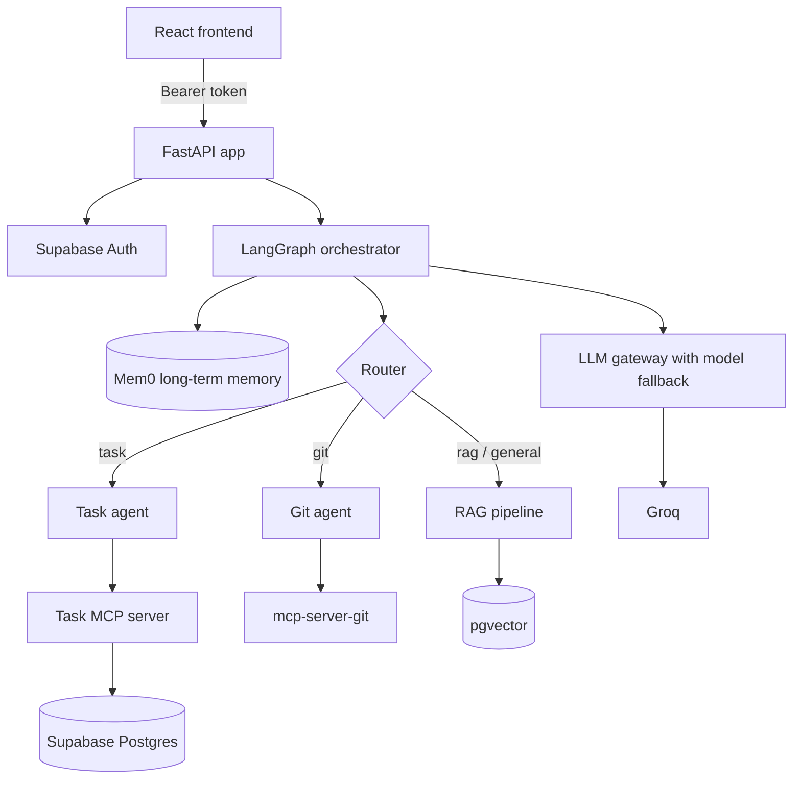

# Personal Assistant

A multi-agent AI personal assistant built with **FastAPI**, **LangGraph**, and **Groq**. Chat with it in plain English to manage your tasks, ask questions about your own uploaded documents, or inspect Git repositories. A LangGraph orchestrator routes each message to the right specialist agent, and long-term memory keeps context across conversations.

~ WORKING URL : https://personal-assistant-4ogi.onrender.com

## Features

- **Task management agent**: create, list, update, complete, and delete tasks by chatting. Tools are exposed through an MCP server backed by Supabase.
- **RAG over your documents**: upload files (including PDFs), which are chunked, embedded, and stored in Supabase `pgvector`. Answers are grounded in your own uploads.
- **Git agent**: ask about commits, branches, diffs, and status for a repo, or paste a public `github.com` URL to have it cloned and inspected via `mcp-server-git`.
- **Smart routing**: fast keyword-based routing first, with an LLM router as fallback.
- **Long-term memory**: per-user memory powered by Mem0 (can be toggled with `MEM0_ENABLED`).
- **LLM fallback chain**: if one Groq model fails, the gateway falls back to the next model in `app/core/config.yml`.
- **Auth and isolation**: Supabase email/password auth with owner-scoped Row Level Security on every table.
- **Built-in React frontend**: login, chat, and document management, served directly by FastAPI.
- **Observability**: optional LangSmith tracing, request ID and timing headers, and rate limiting (15 requests/minute per IP by default).
- **Deploy anywhere**: single Docker image, with a ready-made Render blueprint.

## Architecture



**Request flow:** `load_memory` → `route_request` → (`task` | `git` | `rag`) → `save_memory`

Routing works in two steps: deterministic keyword and phrase matching (for example "create task" or "git diff") handles obvious cases instantly, and anything ambiguous is classified by the LLM with structured output.

## Tech stack

| Layer | Technology |
|---|---|
| API | FastAPI, Uvicorn, Pydantic, SlowAPI |
| Agents | LangChain, LangGraph, LangChain MCP adapters |
| LLM | Groq (via `langchain-groq`) with model fallback |
| Tools | Model Context Protocol (`mcp`, `mcp-server-git`) |
| Data | Supabase (Auth, Postgres, RLS, `pgvector`) |
| Embeddings | FastEmbed (`BAAI/bge-small-en-v1.5`, 384 dims) |
| Memory | Mem0 |
| Frontend | React + Vite |
| Tracing | LangSmith |
| Deployment | Docker, Supervisor, Render |

## Project structure

```text
.
├── app/
│   ├── main.py            # FastAPI app, middleware, CORS, static frontend
│   ├── routes/            # auth, chat, RAG, health endpoints
│   ├── services/          # chat logic and conversation persistence
│   ├── core/              # security, tracing, model list (config.yml)
│   └── frontend/          # React + Vite source
├── agent/
│   ├── graph/             # orchestrator, task agent, git agent, git router
│   ├── rag/               # loading, indexing, retrieval, generation
│   └── memory/            # Mem0 long-term memory wrapper
├── llm_gateway/           # Groq provider, model router, fallback chain
├── mcp_server/            # task MCP tools and git MCP client
├── supabase/              # idempotent SQL: tasks, rag, chat
├── docker/                # entrypoint and Supervisor config
├── tests/                 # pytest tests
├── Dockerfile
├── render.yaml
└── requirements.txt
```

## Getting started

### Prerequisites

- Python 3.11+
- Node.js 22+ (only needed for frontend development)
- Git (required by the Git agent)
- A [Supabase](https://supabase.com) project
- A [Groq](https://console.groq.com) API key

### 1. Clone and install

```bash
git clone https://github.com/krk-90/PERSONAL-ASSISTANT.git
cd PERSONAL-ASSISTANT

python -m venv .venv
source .venv/bin/activate        # Windows: .venv\Scripts\activate
pip install -r requirements.txt
```

### 2. Configure environment

```bash
cp .env.example .env
```

Fill in the values (see [Environment variables](#environment-variables)).

### 3. Set up the database

Run these files in the Supabase **SQL Editor**. They are idempotent, so re-running is safe:

```text
supabase/tasks.sql
supabase/rag.sql
supabase/chat.sql
```

### 4. Run the app

```bash
uvicorn app.main:fastapi_app --reload --reload-dir app
```

- App: <http://localhost:8000>
- Interactive API docs: <http://localhost:8000/docs>

### 5. Frontend development (optional)

The backend serves the prebuilt bundle from `app/frontend/dist`. To hack on the UI with hot reload:

```bash
cd app/frontend
npm install
npm run dev        # Vite dev server on http://localhost:5173
npm run build      # produce the production bundle served by FastAPI
```

### 6. Run the tests

```bash
pytest tests/
```

## Environment variables

| Variable | Required | Description |
|---|---|---|
| `SUPABASE_URL` | Yes | Your Supabase project URL |
| `SUPABASE_KEY` | Yes | Supabase anon key |
| `SUPABASE_SERVICE_ROLE_KEY` | Yes | Service role key (**server-only secret**) |
| `SUPABASE_DB_URL` | Yes | Postgres connection string, used by Mem0 (**server-only secret**) |
| `GROQ_API_KEY` | Yes | Groq API key |
| `CORS_ALLOWED_ORIGINS` | Yes | Comma-separated allowed origins |
| `TASK_USER_ID` | No | Fallback user UUID for standalone server-side scripts only |
| `LANGSMITH_TRACING` | No | `true` to enable tracing (default `false`) |
| `LANGSMITH_API_KEY` | No | LangSmith API key |
| `LANGSMITH_PROJECT` | No | LangSmith project name (default `personal-assistant`) |
| `LANGSMITH_ENDPOINT` | No | Default `https://api.smith.langchain.com` |
| `RAG_EMBEDDING_MODEL` | No | Default `BAAI/bge-small-en-v1.5` |
| `RAG_INDEX_REPO` | No | `true` to also index the repository itself for RAG |
| `MEM0_ENABLED` | No | Toggle long-term memory (default `true`; disabled in `render.yaml`) |
| `MEM0_LLM_MODEL` | No | Default `llama-3.3-70b-versatile` |
| `MEM0_EMBEDDING_MODEL` | No | Default `BAAI/bge-small-en-v1.5` |
| `MEM0_HISTORY_DB_PATH` | No | Default `data/mem0-history.db` |

> **Security:** never expose `SUPABASE_SERVICE_ROLE_KEY` or `SUPABASE_DB_URL` in frontend code or commit real values. `.env` is git-ignored.

## API reference

All routes except `/`, `/health`, `/auth/signup`, and `/auth/login` require `Authorization: Bearer <access_token>`.

| Method | Endpoint | Description |
|---|---|---|
| `GET` | `/` | Serves the frontend |
| `GET` | `/health` | Health check |
| `POST` | `/auth/signup` | Create an account (email + password) |
| `POST` | `/auth/login` | Returns access and refresh tokens |
| `GET` | `/auth/me` | Current user |
| `POST` | `/chat/` | Send a message to the assistant |
| `POST` | `/rag/upload` | Upload a document for retrieval |
| `GET` | `/rag/files` | List your uploaded documents |
| `DELETE` | `/rag/files/{filename}` | Delete an uploaded document |

### Example

```bash
# Log in
curl -X POST http://localhost:8000/auth/login \
  -H "Content-Type: application/json" \
  -d '{"email":"you@example.com","password":"your-password"}'

# Chat, using the returned access_token
curl -X POST http://localhost:8000/chat/ \
  -H "Authorization: Bearer <access_token>" \
  -H "Content-Type: application/json" \
  -d '{"message":"Add a high priority task to submit the report by Friday"}'
```

Response:

```json
{ "reply": "...", "conversation_id": "..." }
```

Pass `conversation_id` on later requests to continue the same conversation.

### Example prompts

| Prompt | Routed to |
|---|---|
| "Add a task: prepare slides, priority high" | Task agent |
| "Show my pending tasks" | Task agent |
| "Mark task `<id>` as complete" | Task agent |
| "Show the last 5 commits" | Git agent |
| "Summarize https://github.com/user/repo" | Git agent |
| "What does my uploaded PDF say about refunds?" | RAG pipeline |

## Middleware

`app/main.py` configures:

- CORS driven by `CORS_ALLOWED_ORIGINS`
- `X-Request-ID` and `X-Process-Time` response headers
- Security headers (content sniffing, framing, referrer, camera/microphone/geolocation)
- Rate limiting (15 requests/minute per IP)
- Static serving of `/assets` and the SPA root

## Database

| Object | Purpose |
|---|---|
| `tasks` | User tasks (status, priority, due date, tags) with owner-scoped RLS |
| `conversations`, `messages` | Chat history with owner-scoped RLS |
| `rag_documents` | Document chunks with `vector(384)` embeddings and owner-scoped RLS |
| `match_rag_documents` (RPC) | Similarity search |
| `match_documents` (RPC) | Compatibility wrapper |

## LLM fallback

Models are tried in the order listed in `app/core/config.yml`. If one fails to load, the gateway moves on to the next. Edit that list to change models or their priority.

## Observability

With `LANGSMITH_TRACING=true`, the router, graph nodes, task and Git agents, RAG generation, memory, and MCP task tools are all traced. User IDs are attached as metadata; API keys, passwords, and bearer tokens are not.

## Docker

A single multi-stage image builds the React frontend and runs FastAPI plus the task MCP server under Supervisor:

```bash
docker build -t personal-assistant .
docker run --rm -p 8000:8000 -p 8001:8001 --env-file .env personal-assistant
```

- App: <http://localhost:8000>
- MCP endpoint (Streamable HTTP): <http://localhost:8001/mcp>

To run the MCP server outside the image, set `MCP_TRANSPORT=streamable-http`, `MCP_HOST=0.0.0.0`, and `MCP_PORT=8001`, then run `python -m mcp_server.tools`.

## Deploy on Render

1. Create a **Blueprint** from this repository (it picks up `render.yaml`).
2. Set the secret variables in the Render dashboard: `SUPABASE_URL`, `SUPABASE_KEY`, `SUPABASE_SERVICE_ROLE_KEY`, `SUPABASE_DB_URL`, `GROQ_API_KEY`, `LANGSMITH_API_KEY`.
3. Set `CORS_ALLOWED_ORIGINS` to your service origin, for example `https://your-service.onrender.com`.

Health check path: `/health`. Production start command:

```bash
uvicorn app.main:fastapi_app --host 0.0.0.0 --port $PORT
```

## License

Licensed under the [Apache License 2.0](LICENSE).
